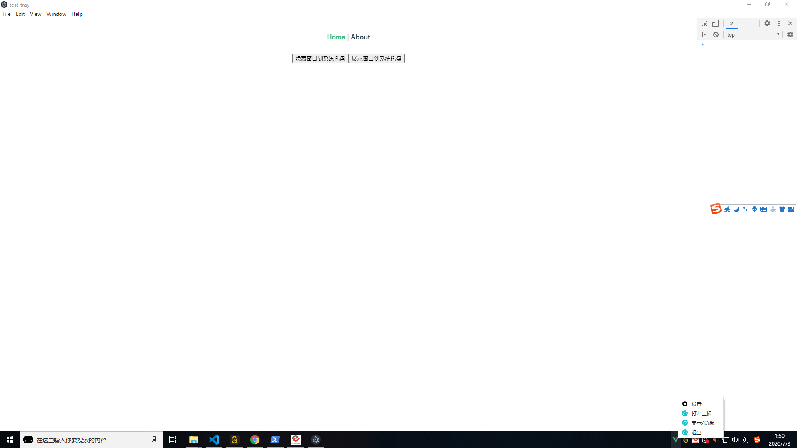

# test-tray

实现应用可隐藏到系统托盘，并添加自定义菜单图标功能

```bash
# 安装模块依赖
yarn install

# 启动项目
yarn start


# 打包项目
yarn run electron:build
```

最终效果图，看右下角



### Customize configuration

See [Configuration Reference](https://cli.vuejs.org/config/).

### "yarn install" error info

```BASH
PS D:\dev\electron-tray> yarn
yarn install v1.22.10
warning package-lock.json found. Your project contains lock files generated by tools other than Yarn. It is advised not to mix package managers in order to avoid resolution inconsistencies caused by unsynchronized lock files. To clear this warning, remove package-lock.json.
[1/4] Resolving packages...
[2/4] Fetching packages...
info fsevents@2.1.3: The platform "win32" is incompatible with this module.
info "fsevents@2.1.3" is an optional dependency and failed compatibility check. Excluding it from installation.
info fsevents@1.2.13: The platform "win32" is incompatible with this module.
info "fsevents@1.2.13" is an optional dependency and failed compatibility check. Excluding it from installation.
[3/4] Linking dependencies...
warning "@vue/eslint-config-standard > eslint-import-resolver-webpack@0.12.2" has unmet peer dependency "webpack@>=1.11.0".
[4/4] Building fresh packages...
$ electron-builder install-app-deps
  • electron-builder  version=22.9.1
  • rebuilding native dependencies  dependencies=win-version-info@3.1.1 platform=win32 arch=x64
  • install prebuilt binary  name=win-version-info version=3.1.1 platform=win32 arch=x64
  • build native dependency from sources  name=win-version-info
                                          version=3.1.1
                                          platform=win32
                                          arch=x64
                                          reason=prebuild-install failed with error (run with env DEBUG=electron-builder to get more information)
                                          error=prebuild-install info begin Prebuild-install version 5.3.6
    prebuild-install info looking for cached prebuild @ C:\Users\v_lishaohai\AppData\Roaming\npm-cache\_prebuilds\e2a3b7-win-version-info-v3.1.1-electron-v85-win32-x64.tar.gz
    prebuild-install http request GET https://github.com/vweevers/win-version-info/releases/download/v3.1.1/win-version-info-v3.1.1-electron-v85-win32-x64.tar.gz
    prebuild-install http 404 https://github.com/vweevers/win-version-info/releases/download/v3.1.1/win-version-info-v3.1.1-electron-v85-win32-x64.tar.gz
    prebuild-install WARN install No prebuilt binaries found (target=11.0.2 runtime=electron arch=x64 libc= platform=win32)

  • rebuilding native dependency  name=win-version-info version=3.1.1
  ⨯ cannot execute  cause=exit status 1
                    out=yarn run v1.22.10
    $ node skip.js || prebuild-install || node-gyp rebuild

    D:\dev\electron-tray\node_modules\win-version-info>if not defined npm_config_node_gyp (node "D:\tools\node\node_modules\npm\bin\node-gyp-bin\\..\..\node_modules\node-gyp\bin\node-gyp.js" rebuild )  else (node "" rebuild )
    info Visit https://yarnpkg.com/en/docs/cli/run for documentation about this command.

                    errorOut=prebuild-install WARN install No prebuilt binaries found (target=11.0.2 runtime=electron arch=x64 libc= platform=win32)
    gyp info it worked if it ends with ok
    gyp info using node-gyp@5.1.0
    gyp info using node@14.15.0 | win32 | x64
    gyp info find Python using Python version 2.7.15 found at "C:\Users\v_lishaohai\.windows-build-tools\python27\python.exe"
    gyp http GET https://electronjs.org/headers/v11.0.2/node-v11.0.2-headers.tar.gz
    gyp WARN install got an error, rolling back install
    gyp ERR! configure error
    gyp ERR! stack Error: connect ETIMEDOUT 99.86.89.25:443
    gyp ERR! stack     at TCPConnectWrap.afterConnect [as oncomplete] (net.js:1146:16)
    gyp ERR! System Windows_NT 10.0.18363
    gyp ERR! command "D:\\tools\\node\\node.exe" "D:\\tools\\node\\node_modules\\npm\\node_modules\\node-gyp\\bin\\node-gyp.js" "rebuild"
    gyp ERR! cwd D:\dev\electron-tray\node_modules\win-version-info
    gyp ERR! node -v v14.15.0
    gyp ERR! node-gyp -v v5.1.0
    gyp ERR! not ok
    error Command failed with exit code 1.

                    command='D:\tools\node\node.exe' 'C:\Users\v_lishaohai\AppData\Roaming\npm\node_modules\yarn\bin\yarn.js' run install
                    workingDir=D:\dev\electron-tray\node_modules\win-version-info
error Command failed with exit code 1.
info Visit https://yarnpkg.com/en/docs/cli/install for documentation about this command.
PS D:\dev\electron-tray>
```

The following steps can be executed to run

```
npm install -g node-gyp
npm install --global --production windows-build-tools

npm start
```
